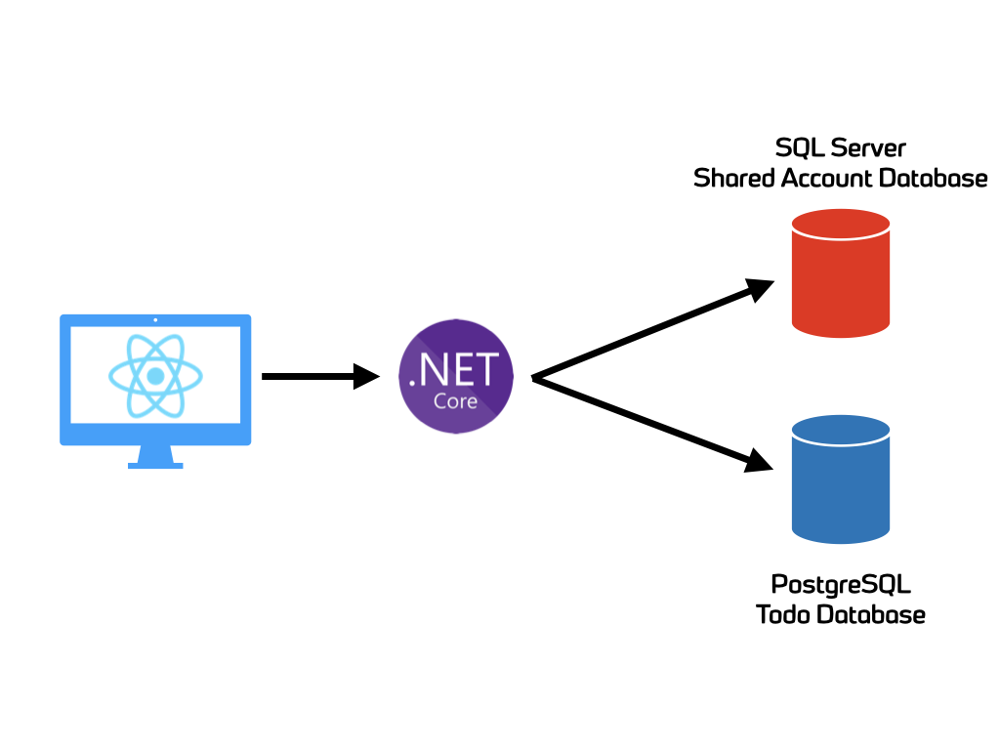

# Spawn demo app - backend

This is the backend portion of the Spawn demo app. The app showcases a semi complex application that takes advantage of [Spawn](https://spawn.cc/) to simplify development.

## Architecture

The application is a simple "Todo" application. It's architecture is as follows:

* C# ASP.NET Core WebAPI
* ReactJS Frontend
* Microsoft SQL Server database (for "account" information)
* PostgreSQL database (for "todo" item information)



## Building

```
cd api
docker build -t spawn-demo-backend .
```

## Running

```
docker run --rm -d -p 8080:8080 spawn-demo-backend
```
